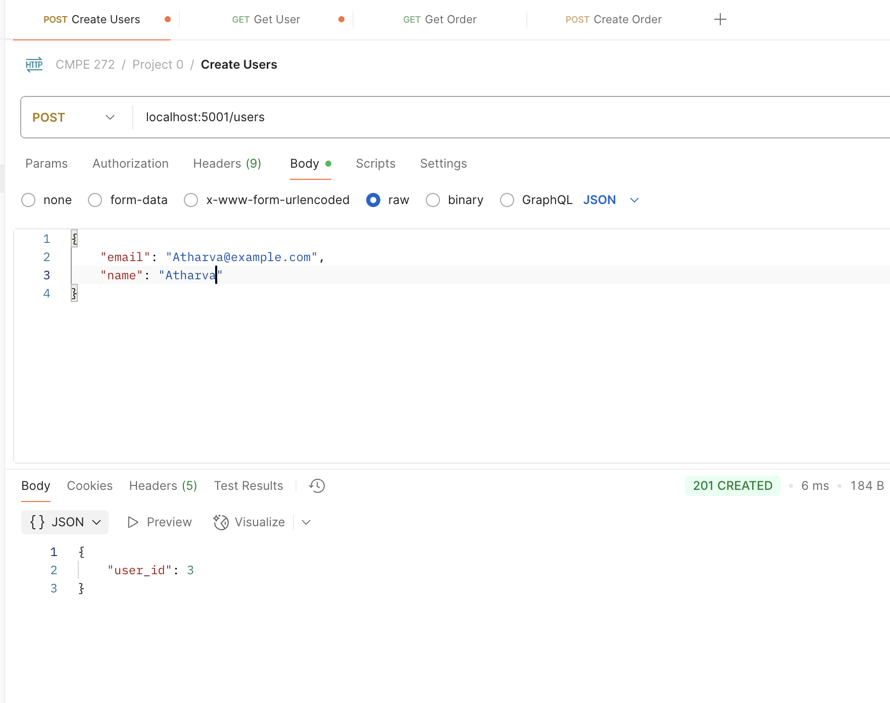
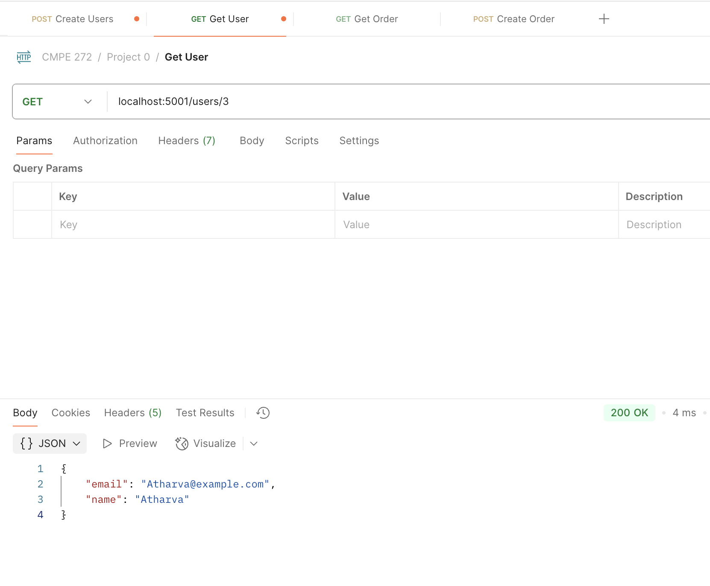
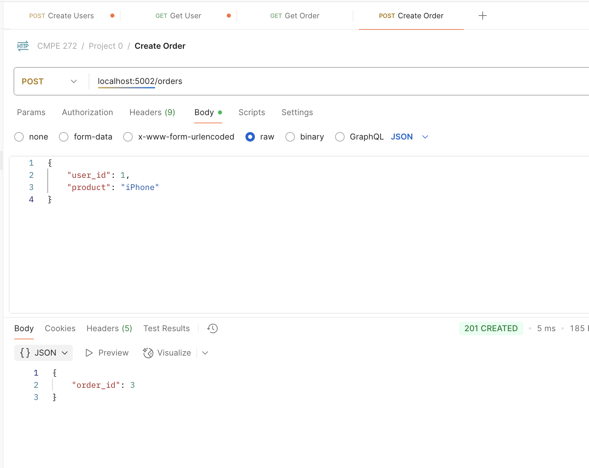
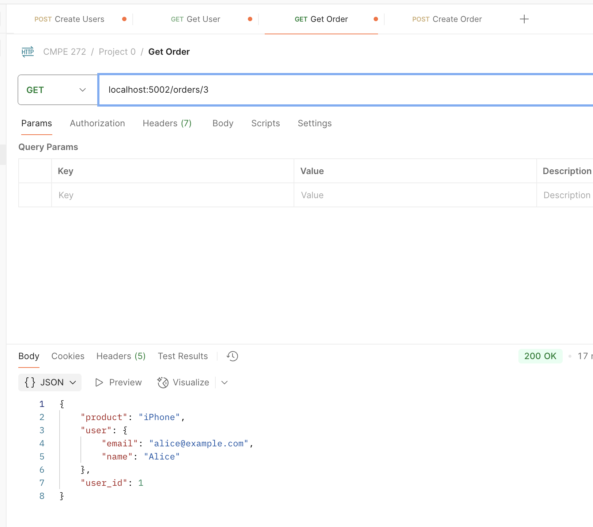

### Create User


```
curl --location 'localhost:5001/users' \
--header 'Content-Type: application/json' \
--data-raw '{
    "email": "Atharva@example.com",
    "name": "Atharva"
}'

```

### Get User


```
curl --location 'localhost:5001/users/3'
```

### Create Order


```
curl --location 'localhost:5002/orders' \
--header 'Content-Type: application/json' \
--data '{
    "user_id": 1,
    "product": "iPhone"
}'
```


### Get Order


```
curl --location 'localhost:5002/orders/3'
```